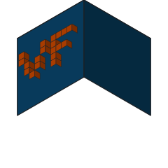
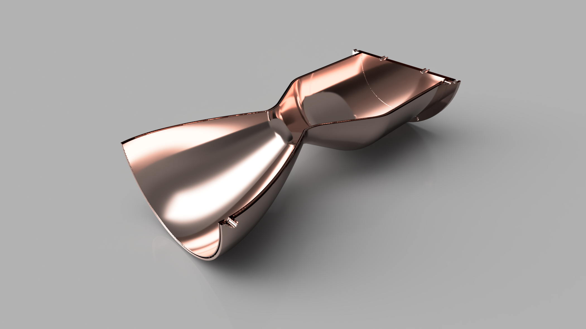
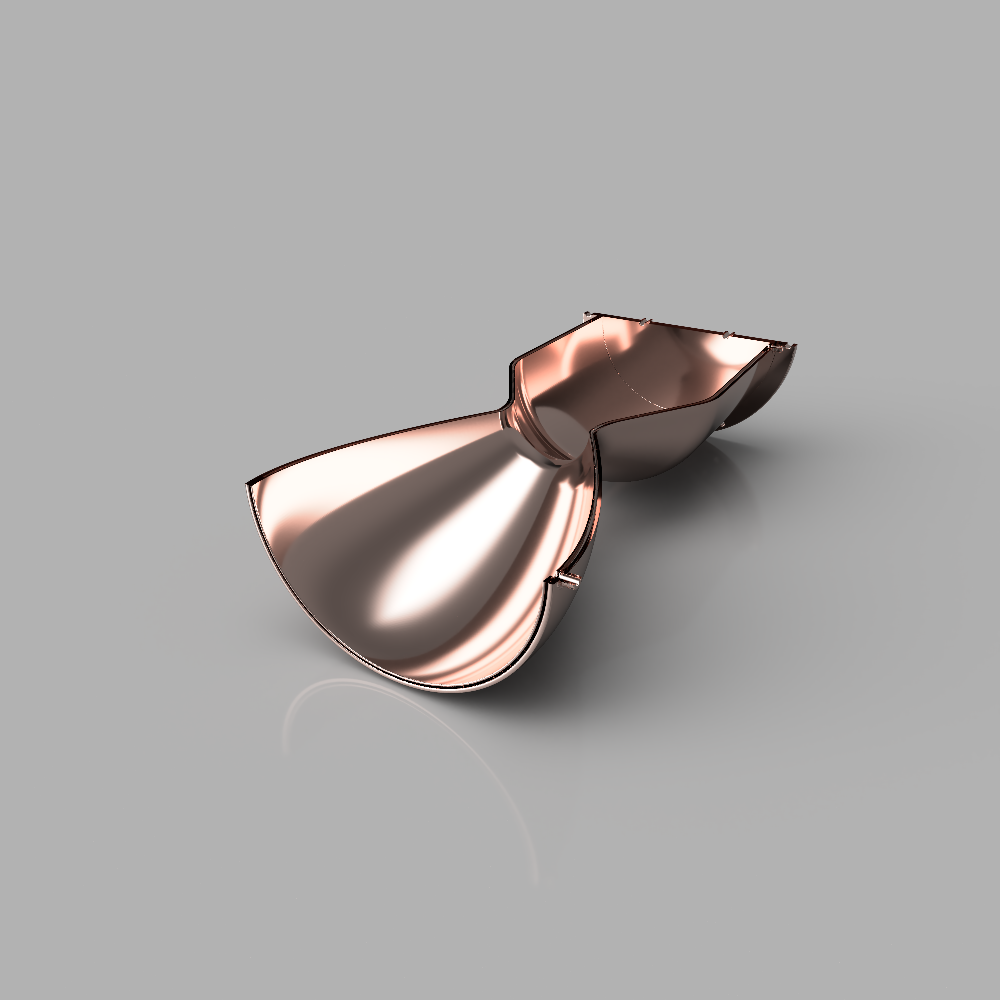
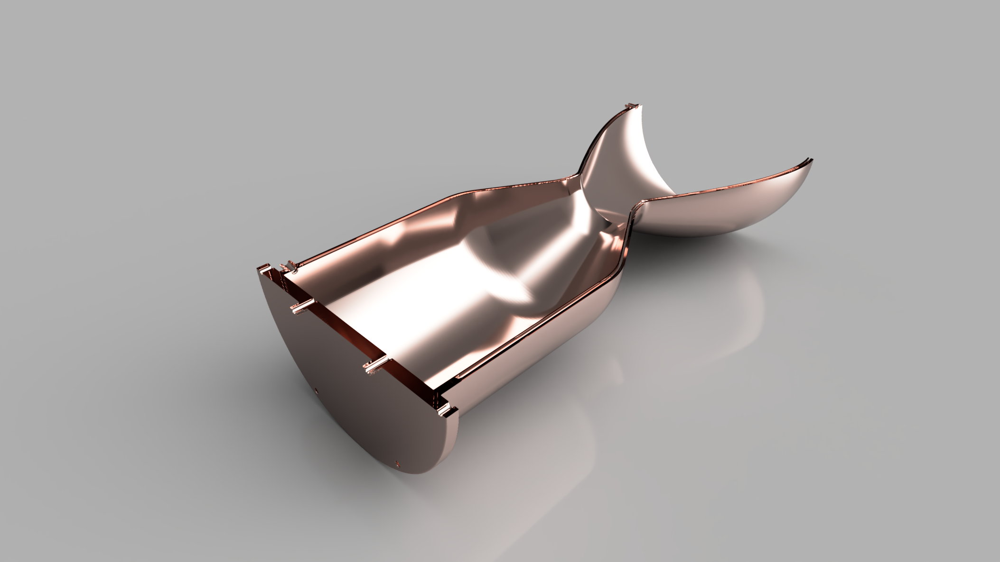

<div align="center">

<picture>
  <source media="(prefers-color-scheme: dark)" srcset="assets/logo-dark.svg">
  
</picture>

# voxelforge

**A physics-based propulsion and power-generation optimizer — rocket thrust chambers, gas turbines, turbofans, electric thrusters, and marine hulls, generated from a handful of parameters.**

[](https://github.com/poetac/voxelforge/actions/workflows/core-linux-tests.yml)
&nbsp;·&nbsp;
[](https://github.com/poetac/voxelforge/actions/workflows/codeql.yml)
&nbsp;·&nbsp;
[](https://github.com/poetac/voxelforge/actions/workflows/ci.yml)

5,700+ tests across 5 physics pillars (+ SU2 verification harness — built, not yet run in CI)  ·  196 feasibility gates  ·  multi-pillar IEngine architecture

<br />



</div>

---

## What it does

Give voxelforge a thrust (or shaft-power, or cruise-speed) target, an operating-condition profile, and a working fluid. It returns a printable engine — contour, channels, injector face / fan / hull, flanges, bosses, and all — as a single STL ready for laser powder-bed fusion. Rocket pillar covers LOX/CH4 / LOX/H2 / LOX/RP-1 regen-cooled bell + aerospike chambers; air-breathing pillar covers ramjet / turbojet (w/ afterburner) / turbofan / scramjet / RBCC / gas-turbine / Rankine-cycle steam turbine / pulsejet / turboprop / turboshaft (10 cycle solvers, plus LACE and RDE); electric propulsion covers resistojet, Hall-effect thruster, arcjet, pulsed plasma thruster, gridded ion, MPD (± applied field), FEEP, HDLT, and VASIMR; marine pillar covers displacement, planing, and semi-displacement AUV hulls; nuclear propulsion covers NERVA-class solid-core NTR and bimodal NTR-Brayton.

A simulated-annealing optimiser (with optional CMA-ES inner refinement, NSGA-II/III Pareto, Bayesian opt with GP surrogate, hybrid SA+CMA-ES, and gradient polish) walks a 34-dimension rocket design space (plus per-pillar dimensions) behind a ring of **196 feasibility gates** (65 rocket · 40 air-breathing · 54 electric · 22 marine · 15 nuclear) that reject candidates violating rotordynamic, cavitation, body-interference, combustion-stability, LPBF-printability, hull buckling, watertight integrity, fan-stall, bypass-duct-choke, RDE wave-count, finite-rate-Isp-penalty, or numerical-stability constraints *before* any expensive voxel work runs. The optimiser runs **multi-chain by default** — N parallel SA chains with strict-determinism elite migration and per-chain Sobol seeding — so a single Start press explores the design space at `min(ProcessorCount − 2, 16)` chains in parallel.

<p align="center">
  
  
</p>

## Why voxel-implicit geometry

Mesh-based CAD struggles with the geometry additive manufacturing actually unlocks: conformal TPMS coolant channels, monolithic fusion of chamber + turbopump + feed manifold into a single part, aerospike plug cooling with internally-routed regen passages. voxelforge runs on [PicoGK](https://picogk.org/), a voxel-implicit kernel where those operations are boolean-trivial. A coolant channel isn't a swept surface — it's the negative of a Schwarz P field clipped to a chamber shell.

## Capabilities

### Combustion & thermodynamics
- LOX/CH4, LOX/H2, and LOX/RP-1 propellant tables with equilibrium corrections
- Bartz hot-gas-side heat-flux model
- Film-cooling block, ablative-wall analysis, injector-face thermal model
- Atomisation SMD (Sauter mean diameter) estimates for droplet populations
- Crocco N-τ combustion-stability screening — chug, buzz, and screech modes
- Start-transient simulation

### Coolant & heat transfer
- Hydrogen, methane, and RP-1 coolant fluids with property correlations
- Dittus–Boelter / Gnielinski / Sieder–Tate correlations plus TPMS-channel variants
- Full regen-cooling solver with chilldown transient
- Purge-flow modelling

### Geometry & manufacturing
- Implicit chamber contours, aerospike plugs, preburner chambers, turbine and pump impellers
- TPMS coolant channels (Schwarz P, Gyroid) generated directly from implicits
- Injector-face layout with coax, impinging-doublet, pintle, showerhead, and swirl elements
- Port standards, mounting-flange presets, sensor-boss presets, umbilical standards
- Build-orientation advisor, overhang analysis, residual-stress estimation
- STL welding / multi-subsystem fusion for single-print monolithic engines
- 3MF and CFD-field export

### Feed system
- Full propellant-line pressure stack-up
- Line-loss, valve Cv, and filter catalogues
- Turbopump and turbine sizing with shaft critical-speed / rotordynamic check
- Feed-manifold auto-routing

### Optimisation
- Simulated-annealing optimiser over a unified `RegenChamberDesign` record
- **Multi-chain SA** runs N parallel chains with strict-determinism elite migration + per-chain Sobol seeding (4-8× wall-clock speedup over single-chain on every run); legacy single-chain + (1+λ) parallel-batch path remains selectable
- **65 rocket feasibility gates** (196 project-wide across all 5 physics pillars) spanning body intersection, tube-vs-tube interference, rotordynamics, cavitation, combustion-stability (chug / buzz / screech + pintle blockage / TMR), voxel adequacy, memory projection, time-step floor, pressure-fed blow-down end-of-burn, expander-cycle turbine enthalpy balance, ORSC ox-rich corrosion margin, tap-off hot-gas turbine-inlet margin, LPBF printability (per-alloy overhang, trapped-powder, drain-path), linear-aerospike aspect-ratio envelope, instrumentation-tap / channel-bore interference, per-propellant-pair ignition energy + modality suitability, pump pressure inversion, ASME burst-margin (2.5×), and mega-scale envelope
- Pareto-front tracking and run provenance
- Auto-seeder and solver-warning collation

### User experience
- **Setup wizard** runs on first launch — 3-page guided picker (preset / propellants & cycle / topology + injector pattern) so newcomers don't face all ~104 form controls at once
- **Conditional disclosure** — picking PressureFed hides the turbopump section, picking Aerospike topology hides discrete-channel knobs, picking LOX/H2 surfaces ClosedExpander as the natural cycle. Driven by a centralised `UiVisibilityRules` table that mirrors `[SaDesignVariable]`'s gate predicates so optimizer + UI agree on what's relevant
- **24 published-engine validation fixtures** spanning all 3 supported propellant pairs and all 4 supported cycle paths — RL10A-3-3A, Merlin-1D + Merlin-1D Vacuum, J-2 + J-2X, Vinci, HM7B, SSME, BE-4, Raptor 1 + Raptor 2, NK-33, RD-180 + RD-191, RS-68A, Vulcain 2, LE-5B, LE-7A, RD-170, Vulcain 1, BE-3, RL10B-2, NK-15, F-1 — pin voxelforge's predicted Isp / mass-flow / throat geometry to real flying hardware within documented preliminary-design bands (Isp ±5–20 % vacuum/frozen-flow, geometry ±10–15 %; thrust is a fixture *input*, not a validated prediction)

### Air-breathing engines (`Voxelforge.Airbreathing`)

- **Engines:** ramjet, turbojet (± afterburner), turbofan, scramjet, RBCC, gas turbine, Rankine-cycle steam turbine, pulsejet, turboprop, turboshaft, plus LACE and RDE (10 cycle solvers)
- Two-spool turbofan with bypass + fan + steam-condense gates
- J79 / F404 / F100 / V-1 (Argus As 109-014) / T56-A-15 / T700-GE-701C fixtures pin predictions to real flying hardware within preliminary-design tolerance bands
- Ramjet voxel preview via `--airbreathing` mode in the main app
- Schema v12; per-pillar `AirbreathingFeasibility.Evaluate` parallel gate evaluator

### Electric propulsion (`Voxelforge.ElectricPropulsion`)

- **Nine thruster families:** resistojet, Hall-effect thruster, arcjet, pulsed plasma thruster, gridded ion, MPD (± applied field), FEEP, HDLT, and VASIMR
- Published-engine fixtures including MR-501B (resistojet), BPT-4000 (HET, Goebel & Katz model), MR-509 ATOS (arcjet, Maecker-Kovitya thermal-arc), Aerojet EO-1 (PPT, Solbes-Vondra ablation), NEXT-C (gridded ion), Indium FEEP, ANU HDLT, and VX-200i (VASIMR)
- 54 EP gates — kind-predicated dispatch in `ElectricPropulsionFeasibility.Evaluate`
- `IPlasmaState` shared abstraction lives in `Voxelforge.Core/Plasma/` with nine concrete consumers (see [ADR-029a](Voxelforge/docs/ADR/ADR-029a-iplasmastate-promotion.md))
- IEngine-clean discipline boundary: no rocket-physics imports (analyzer VFA001 enforces)

### Marine hulls (`Voxelforge.Marine`)

- **Vehicles:** displacement, planing, and semi-displacement AUV / surface-drone hulls
- Hoerner / Myring / Holtrop-Mennen / Savitsky physics for drag, fairing geometry, pressure-hull buckling
- 22 `HULL_*` gates spanning buoyancy, ASME UG-28 buckling SF, watertight integrity, depth rating, fineness ratio
- REMUS-100 / 600 / 6000 and Bluefin-21 fixtures pin predictions to real hardware within preliminary-design tolerance bands

## Platform

- **.NET 9** targeting `net9.0-windows` with Windows Forms for the viewer
- **PicoGK 2.2.0** voxel kernel (version pinned — see [ADR-011](Voxelforge/docs/ADR/ADR-011-picogk-version-pinning.md))
- **Windows 10 / 11**
- **16 GB** RAM minimum; **64 GB** recommended for larger chambers (see [ADR-006](Voxelforge/docs/ADR/ADR-006-64gb-ram-constraint.md))

## Projects

| Project | Role |
| --- | --- |
| [`Voxelforge.Core`](Voxelforge.Core/) | Headless rocket-physics library + family-agnostic platform: combustion, heat transfer, coolant, feed system, optimization data records, IO, `IEngine<,,>`, `EngineFamilies`, `GateRegistry`. No PicoGK, no WinForms. |
| [`Voxelforge.Voxels`](Voxelforge.Voxels/) | PicoGK-using voxel/SDF builders. References Core. Targets `net9.0-windows`. |
| [`Voxelforge`](Voxelforge/) | Main rocket application — WinForms UI, orchestrators, entry point, `--airbreathing` mode dispatch. References Core + Voxels. |
| [`Voxelforge.StlExporter`](Voxelforge.StlExporter/) | STL export utilities, callable as a subprocess. |
| [`Voxelforge.Renderer`](Voxelforge.Renderer/) | Optional Blender-subprocess renderer for high-quality PBR + HDRi stills + orbit GIFs. |
| [`Voxelforge.Eval`](Voxelforge.Eval/) | `voxelforge-eval` subprocess oracle — JSON-on-stdin scoring for external Python / Julia / R tooling. |
| [`Voxelforge.Tests`](Voxelforge.Tests/) | xUnit test suite. References the main app + StlExporter. Voxel-building tests use in-process xUnit with `LibraryScope` (PicoGK 2.2.0). |
| [`Voxelforge.Benchmarks`](Voxelforge.Benchmarks/) | Console benchmarks + voxel experiments + `bench-sa` / `bench-diff` / `bench-runtime-audit` CLI. Per-pillar baselines under `baselines/<pillar>/`. |
| [`Voxelforge.MicroBenchmarks`](Voxelforge.MicroBenchmarks/) | BenchmarkDotNet microbench suite (50+ benches across LpbfPrintability / EngineCycles / JsonRoundTrip / ThreeMfExport / ToleranceSweep / CoolantCorrelations / BartzPerStation / FeasibilityGate). |
| [`Voxelforge.Analyzers`](Voxelforge.Analyzers/) | Roslyn analyzers — VFD001-016 (`[Deterministic]`) + VFA001-002 (cross-family-import + family-namespace purity). |
| [`Voxelforge.Generators`](Voxelforge.Generators/) | Incremental source generator emitting `[SaDesignVariable]` accessor table (compile-time, AOT-clean). |
| [`Voxelforge.Airbreathing.{Core,Tests,Voxels,StlExporter}`](Voxelforge.Airbreathing.Core/) | Air-breathing pillar — ramjet, turbojet, turbofan, scramjet, RBCC, gas turbine, Rankine-cycle steam turbine, pulsejet. |
| [`Voxelforge.ElectricPropulsion.{Core,Tests,Voxels,StlExporter}`](Voxelforge.ElectricPropulsion.Core/) | Electric propulsion pillar — resistojet, HET, arcjet, PPT, gridded ion, MPD (± applied field), FEEP, HDLT, VASIMR. |
| [`Voxelforge.Marine.{Core,Tests,Voxels,StlExporter}`](Voxelforge.Marine.Core/) | Marine pillar — displacement / planing / semi-displacement AUV hulls (Hoerner / Myring / Holtrop-Mennen / Savitsky; REMUS + Bluefin-21 fixtures). |
| [`Voxelforge.Nuclear.{Core,Tests,Voxels,StlExporter}`](Voxelforge.Nuclear.Core/) | Nuclear pillar — NERVA-class solid-core NTR + bimodal NTR-Brayton (NRX-A6 fixture; LEU/HALEU/HEU enrichment tiers). |
| [`Voxelforge.Cfd.{Core,Tests}`](Voxelforge.Cfd.Core/) | CFD verification pillar — SU2-based oracle (mesh writer, runner, surface parser, drift report). |

`voxelforge.sln` at the repo root ties them together. The Core / Voxels / App split landed via [ADR-015](Voxelforge/docs/ADR/ADR-015-core-voxels-app-split.md) — Core is what unblocks subprocess oracles + future CFD validation + cross-platform headless tooling.

## Build & run

```bash
# from the repo root
dotnet restore voxelforge.sln
dotnet build   voxelforge.sln
dotnet test    Voxelforge.Tests/Voxelforge.Tests.csproj
dotnet run     --project Voxelforge/Voxelforge.csproj
```

## Documentation

Reference docs for people evaluating, using, or extending voxelforge.
Every document below is grounded in live source code, not marketing:

- **[`GATES.md`](Voxelforge/docs/GATES.md)** — the project-wide feasibility-gate catalogue across all five pillars (rocket · air-breathing · electric · marine · nuclear), what each one checks, and the uncertainty band it inherits.
- **[`DESIGN_VARIABLES.md`](Voxelforge/docs/DESIGN_VARIABLES.md)** — the 34-dim SA search space, one row per `[SaDesignVariable]` attribute.
- **[`PHYSICS.md`](Voxelforge/docs/PHYSICS.md)** — heat-transfer, friction, combustion-stability, and feed-system correlations with canonical citations and uncertainty bands.
- **[`LIMITATIONS.md`](Voxelforge/docs/LIMITATIONS.md)** — the honest list of what voxelforge does *not* model, and what to do with an output before first fire.
- **[`FAQ.md`](Voxelforge/docs/FAQ.md)** — specific answers to real questions about running, contributing, and comparing.
- **[`examples/`](examples/)** — scaffold for reproducible designs: input JSONs today, with SHA-256 receipts (and renders / STL) to land as designs are committed and regenerated on a PicoGK rig.
- **[`CHANGELOG.md`](CHANGELOG.md)** and **[`ROADMAP.md`](ROADMAP.md)** — shipped work and what's next.

## Website

The public-facing documentation website lives in [`site/`](site/) — 13 static HTML pages with no framework and no build step.
**Documentation site: [`https://poetac.github.io/voxelforge/`](https://poetac.github.io/voxelforge/)** (or open `site/index.html` locally).

GitHub Pages is deployed via [`.github/workflows/pages.yml`](.github/workflows/pages.yml) (auto-triggers on pushes to `main` that touch `site/**`).
To enable: GitHub → Settings → Pages → Source → **GitHub Actions**.

## Architecture

Load-bearing design decisions live as ADRs in [`Voxelforge/docs/ADR/`](Voxelforge/docs/ADR/).
The [ADR index](Voxelforge/docs/ADR/README.md) has a
one-line summary per record; the most-referenced are:

- **ADR-001** — PicoGK voxel kernel
- **ADR-003** — Simulated-annealing optimiser
- **ADR-009** — Feasibility-gate discipline (regen + aerospike-parallel + monolithic + advisory bands)
- **ADR-015** — Core / Voxels / App project split
- **ADR-017** — Multi-chain parallel SA wiring
- **ADR-010** — Hard-coded bounds debt *(Resolved — Sprint 6 Track A + Sprint 7 Track C)*
- **ADR-011** — PicoGK version pinning
- **ADR-012** — Adding an SA design variable (post-resolution workflow)

ADR numbers are stable; gaps (ADR-004, ADR-008) signal deliberate
removal — see the "Removed ADRs" table in the index.

## Contributing

Branch, push, open a pull request. Tests must pass before merge;
New voxel-building tests use in-process xUnit with `LibraryScope` (see pitfall #8 in `CLAUDE.md`); subprocess tests are reserved for CLI-surface, cross-process-determinism, and cross-platform scenarios.
See [`CONTRIBUTING.md`](CONTRIBUTING.md) for the hotspot-file
coordination protocol and [FAQ](Voxelforge/docs/FAQ.md#contributing)
for the common "how do I add X" recipes.

**New here? Start with these in order:**

1. Read this README's [What it does](#what-it-does) + [Capabilities](#capabilities) sections.
2. Skim [`LIMITATIONS.md`](Voxelforge/docs/LIMITATIONS.md) — what voxelforge does *not* model.
3. Run `dotnet test` to confirm your environment is clean.
4. Pick a starter — try `dotnet run --project Voxelforge` to launch the UI, or `dotnet run --project Voxelforge.Benchmarks -- --bench-sa --design-preset merlin --multi-chain` for a headless SA run.
5. For your first PR, look for issues tagged `good-first-issue`, or pick a small item from [`ROADMAP.md`](ROADMAP.md)'s "Demand-driven" section.
6. Read [`CONTRIBUTING.md`](CONTRIBUTING.md)'s **Hotspot file coordination** section before touching the listed files.

Issue templates: [bug report](.github/ISSUE_TEMPLATE/bug_report.md), [feature request](.github/ISSUE_TEMPLATE/feature_request.md), and [print / hot-fire failure](.github/ISSUE_TEMPLATE/print_failure.md) — the last one is for sharing real-world outcomes when a voxelforge design hits hardware.

## Citing

If you use voxelforge in academic or engineering work, citation
metadata is in [`CITATION.cff`](CITATION.cff).

## License

MIT — see [`LICENSE`](LICENSE). voxelforge depends on
[PicoGK](https://picogk.org/) (LEAP 71), which is licensed
separately; see the PicoGK repository for its terms. Brand assets:
[`assets/BRAND.md`](assets/BRAND.md).

## Acknowledgements

Built on **[PicoGK](https://picogk.org/) 2.2.0** by LEAP 71.
