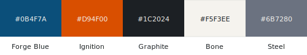

# voxelforge — brand

## Palette

| Role | Name | Hex |
| --- | --- | --- |
| Primary | Forge Blue | `#0B4F7A` |
| Accent | Ignition | `#D94F00` |
| Text / dark surfaces | Graphite | `#1C2024` |
| Warm neutral | Bone | `#F5F3EE` |
| Secondary text, rules | Steel | `#6B7280` |

## Marks

- [`logo.svg`](logo.svg) — primary mark, light backgrounds
- [`logo-dark.svg`](logo-dark.svg) — dark-mode variant
- [`logo-combo-*.svg`](.) — lockup explorations
- [`social-preview.svg`](social-preview.svg) — 1280 × 640 GitHub social card

## Usage

The primary mark should not be re-coloured or re-composed when embedded. Preserve clear space equal to the height of the "V" on all sides. Prefer the dark-mode variant on surfaces darker than Graphite.
